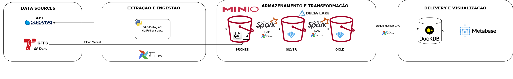

# SPTrans - Monitoramento

## Objetivo
Este projeto tem como objetivo desenvolver um pipeline de dados completo para o monitoramento do transporte público da cidade de São Paulo, utilizando a API Olho Vivo da SPTrans.
O pipeline realiza a ingestão, transformação e disponibilização dos dados, orquestrado pelo Apache Airflow, com armazenamento no MinIO e processamento via PySpark. Os dados brutos são armazenados em camadas Bronze (JSON) e transformados em Silver e Gold (Delta) para posterior análise e consumo via DuckDB e Metabase.

O sistema coleta informações de posição dos ônibus a cada 2 minutos (batch), e os dados transformados alimentam um dashboard interativo, que exibirá informações em near real-time e KPIs operacionais do sistema de transporte.

O projeto tem foco em aprendizado e portfólio, aplicando boas práticas de engenharia de dados e arquitetura de pipelines escaláveis.

## Arquitetura de Solução



## Stack de Tecnologias

| Componente          | Função                      | Tecnologia                          |
| ------------------- | --------------------------- | ----------------------------------- |
| 🧩 Orquestração     | Agendamento e monitoramento | **Apache Airflow 2.10** + Postgres 15 backend |
| ⚡ Processamento     | ETL e transformações        | **Apache Spark 3.5.3 + Delta Lake 3.3.2** |
| 🪣 Armazenamento    | Data Lake compatível com S3 | **MinIO**                           |
| 🗄️ Banco analítico | Consultas rápidas e locais, alimenta o Metabase  | **DuckDB**                          |
| 📊 Visualização     | Dashboards e KPIs           | **Metabase**                        |
| 🐍 Linguagem        | Ingestão e integração       | **Python 3**                     |
| 🛰️ Fonte de dados  | API em tempo real e GTFS    | **SPTrans Olho Vivo + GTFS**        |


Docker - containerização e ambiente padronizado para todos os serviços

## Camadas de Dados do Data Lake (Medalhão)

| Camada        | Formato | Descrição                                        |
| ------------- | ------- | ------------------------------------------------ |
| 🥉 **Bronze** | JSON e TXT(CSV)   | Dados brutos extraídos da API SPTrans e arquivos estáticos do GTFS da SPTrans   |
| 🥈 **Silver** | Delta   | Dados tratados, normalizados e particionados.    |
| 🥇 **Gold**   | Delta   | Dados analíticos prontos para KPIs e dashboards. |

## Pipelines e DAGs

1. Ingestão (Bronze)
   1. ```ingest_linhas_paradas.py``` -  1x/dia
     * Baixa dados de linhas e paradas via API.
     * Salva em ```s3a://bronze/linhas/``` e ```s3a://bronze/paradas/``` particionado por ano/mês/dia.
   2. ```ingest_transform_posicao.py``` - 1x/2 minutos
     * Captura informações sobre posição de ônibus em near real-time.
     * Salva em ```s3a://bronze/posicao/``` particionado por ano/mês/dia.
   3. Upload manual do [GTFS SPTrans](https://www.sptrans.com.br/desenvolvedores/) para ```s3a://bronze/gtfs/``` 1x/semana
2.  Transformação (Silver)
    1.  ```transform_linhas_bronze_silver.py``` - Cria Delta table de linhas.
    2.  ```transform_paradas_bronze_silver.py```- Cria Delta table de paradas.
    3.  ```transform_gtfs_bronze_silver.py``` - Processa os arquivos GTFS (`routes`, `stops`, `trips`, `stop_times`, `shapes`).
    4.  ```transform_posicao_bronze_silver.py```- Cria Delta Table incremental de posições (merge(upsert) por `codigo_veiculo` e `hora_referencia`)
3.  Camada Gold (Analítica)
    1.  ```transform_gold_dim_linha.py``` - Junta Silver/linhas com GTFS/routes para criar dimensão de linha.
    2.  ```transform_gold_dim_parada.py``` - Enriquece paradas da API com dados estáticos do `GTFS/stops` para criar a dimensão de parada.
    3.  ```transform_gold_fato_posicao.py``` - Mantém apenas os dados fatos da posição de ônibus, integrando posição da silver e `codigo_linha`.
   
## Dashboard


<!-- ##### Pré-requisitos
- [Docker e Docker Compose](https://docs.docker.com/compose/install/) instalados.
- [Chave de acesso da API Olho Vivo da SPTrans.](https://www.sptrans.com.br/desenvolvedores/api-do-olho-vivo-guia-de-referencia/)

##### Configuração
1. Clonar o repositório:
```
git clone https://github.com/krexaim/sptrans-monitoramento.git
cd sptrans-monitoramento
```
2. Criar um arquivo .env, copiar/colar os seguintes dados no .env e inserir o seu token da API
```
#SPTRANS
SPTRANS_API_KEY= seu token aqui

# MINIO
MINIO_ENDPOINT_LOCAL=localhost:9000
MINIO_ENDPOINT_DOCKER=minio:9000
MINIO_ROOT_USER=admin
MINIO_ROOT_PASSWORD=minioadmin
```
##### Subindo o ambiente
```
docker compose up -d
```
##### Acessando os dados
| Serviço | Usuário | Senha | 
|---|---|---|
| [Airflow](http://localhost:8080/) | admin | admin |
| [MinIO](http://localhost:9001/login) | admin | minioadmin |
| [Spark Master UI](http://localhost:8081) | n/a | n/a|
| [Metabase](http:O//localhost:3000)| criar | criar | -->

## Autores

<p align="center">
  <table>
    <tr>
      <td align="center" width="50%">
        <strong>Alex Kim</strong><br>
         <a href="https://www.linkedin.com/in/alex-kim-97b97910b/" target="_blank">LinkedIn</a>  
        |  <a href="https://github.com/krexaim" target="_blank">GitHub</a>
      </td>
      <td align="center" width="50%">
        <strong>Ítalo Berioni</strong><br>
         <a href="https://www.linkedin.com/in/italoberioni/" target="_blank">LinkedIn</a>  
        |  <a href="https://github.com/Beriond" target="_blank">GitHub</a>
      </td>
    </tr>
  </table>
</p>